# CLI API仕様書

本ドキュメントは、コマンドライン引数を API エンドポイント風に表現した仕様書です。  
各エンドポイントには詳細な説明が含まれています。

---

## エンドポイント一覧

### GET `--help`

- **概要**  
  ヘルプメッセージを表示します。  
  このオプションを指定すると、利用可能なすべてのコマンドや引数、 
  それぞれの説明が一覧形式でターミナルに出力されます。  
  初めて利用するユーザー向けに最も基本的なガイドを提供します。

- **リクエストパラメータ**: なし  
- **レスポンス**: 利用可能なコマンドとオプションの一覧  

---

### GET `--version`

- **概要**  
  アプリケーションのバージョン情報を表示します。  
  ビルド番号やリリース日が含まれる場合もあります。  
  バグ報告や環境調査時に、どのバージョンを利用しているか確認するために使います。

- **リクエストパラメータ**: なし  
- **レスポンス**: アプリケーションのバージョン番号  

---

### POST `--config`

- **概要**  
  外部の設定ファイルを読み込み、アプリケーションの挙動を制御します。  
  設定ファイルは JSON または YAML 形式が推奨され、  
  データベース接続やログレベルなどをまとめて指定することができます。  

- **リクエストパラメータ**  
  - `config` (string, 必須) — 設定ファイルへのパス  

- **レスポンス**  
  設定の適用結果。エラーがある場合は詳細メッセージを返します。  

---

### POST `--output`

- **概要**  
  出力先ディレクトリを指定します。  
  生成される成果物（例: ビルド成果物、ログ、レポート）がこのディレクトリに保存されます。  
  パスを指定しない場合は、デフォルトの `./dist` が利用されます。  

- **リクエストパラメータ**  
  - `path` (string, 任意, default: `./dist`) — 出力先のパス  

- **レスポンス**  
  出力先ディレクトリの確認メッセージ  

---

### PATCH `--verbose`

- **概要**  
  詳細なログ出力を有効化します。  
  デバッグやトラブルシューティングを行う際に役立ちます。  
  通常は INFO レベルのログが出力されますが、このフラグを有効にすると  
  DEBUG レベルの詳細な情報が追加で表示されます。  

- **リクエストパラメータ**: なし  
- **レスポンス**: ログレベル設定の適用結果  

---

### DELETE `--dry-run`

- **概要**  
  実際に処理を行わず、実行内容だけをシミュレーションします。  
  ファイルの生成や削除といった副作用を伴わないため、 
  実行前に安全に挙動を確認する用途で利用されます。  

- **リクエストパラメータ**: なし  
- **レスポンス**  
  実行予定の処理内容一覧を返します。


# Tutorial Intro

Let's discover **Docusaurus in less than 5 minutes**.

## Getting Started

Get started by **creating a new site**.

Or **try Docusaurus immediately** with **[docusaurus.new](https://docusaurus.new)**.

### What you'll need

- [Node.js](https://nodejs.org/en/download/) version 18.0 or above:
  - When installing Node.js, you are recommended to check all checkboxes related to dependencies.

## Generate a new site

Generate a new Docusaurus site using the **classic template**.

The classic template will automatically be added to your project after you run the command:

```bash
npm init docusaurus@latest my-website classic
```

You can type this command into Command Prompt, Powershell, Terminal, or any other integrated terminal of your code editor.

The command also installs all necessary dependencies you need to run Docusaurus.

## Start your site

Run the development server:

```bash
cd my-website
npm run start
```

The `cd` command changes the directory you're working with. In order to work with your newly created Docusaurus site, you'll need to navigate the terminal there.

The `npm run start` command builds your website locally and serves it through a development server, ready for you to view at http://localhost:3000/.

Open `docs/intro.md` (this page) and edit some lines: the site **reloads automatically** and displays your changes.

```mermaid
flowchart LR
  A[Start] --> B{条件}
  B -->|はい| C[処理]
  B -->|いいえ| D[中止]
```




:::tip ヒント
ここにコツを書く
:::

import Tabs from '@theme/Tabs';
import TabItem from '@theme/TabItem';

<Tabs>
  <TabItem value="Windows">…</TabItem>
  <TabItem value="Linux">…</TabItem>
</Tabs>


```bash title="デプロイ手順" {1,3}
npm ci
npm run build
- onBrokenLinks: 'throw'
+ onBrokenLinks: 'log'
```


## 🔹 各言語の Markdown 記法サンプル

```c
#include <stdio.h>
int main() {
    printf("Hello, C!\n");
    return 0;
}
```

```cpp
#include <iostream>
using namespace std;
int main() {
    cout << "Hello, C++!" << endl;
    return 0;
}
```

```csharp
using System;
class Program {
    static void Main() {
        Console.WriteLine("Hello from C#!");
    }
}
```

```python
def hello():
    print("Hello from Python!")

hello()
```

```go
package main
import "fmt"
func main() {
    fmt.Println("Hello from Go!")
}
```

```rust
fn main() {
    println!("Hello from Rust!");
}
```

```ruby
puts "Hello from Ruby!"
```

```powershell
Write-Output "Hello from PowerShell!"
```

```bash
echo "Hello from Bash!"
```

```sql
SELECT id, name, email
FROM users
WHERE status = 'active'
ORDER BY created_at DESC;
```